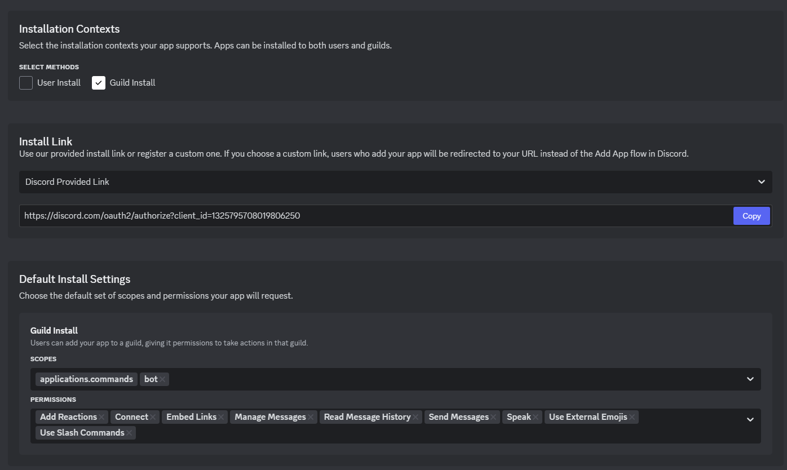
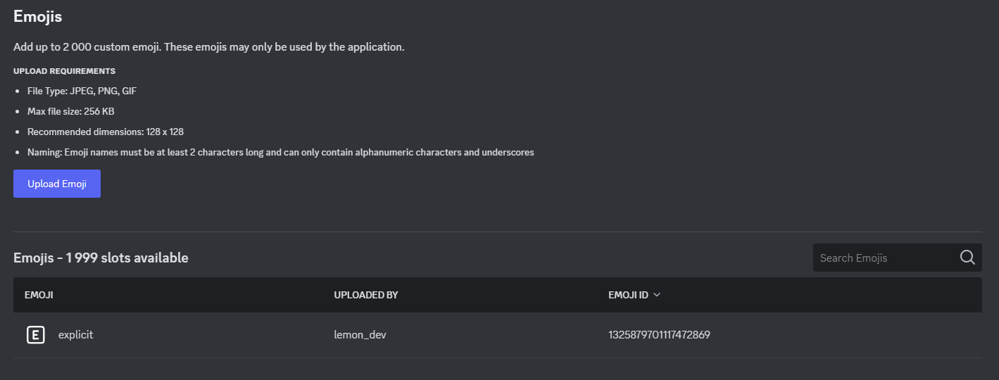

<p align="center">
  
</p>

<h1 align="center">YandexMusicDiscordBot</h1>

<p align="center">
  <i>Ваш личный музыкальный бот, использующий API Яндекса, потому что, а почему бы и нет!</i>
</p>

<div align="center">
  <p align="center">
    <strong>YandexMusicDiscordBot или его разработчик не связаны с Яндексом или какой-либо из их компаний, сотрудников и т.д. Товарный знак и логотипы являются собственностью их владельцев.</strong>
  </p>
  <a target="_blank" href="https://creativecommons.org/licenses/by-nc-sa/4.0/">
    
  </a>
  <a target="_blank" href="https://discord.gg/TgnW8nfbFn">
    
  </a>
  <a target="_blank" href="https://boosty.to/lemon_dev">
    
  </a>
</div>

## Предисловие

Бот написан на Python с использованием Pycord и других вспомогательных библиотек.

- Это не замена Яндекс Музыки. Качество звука заметно хуже, а вещание может сбоить.
- Данный бот не предоставляет средств для обхода подписки, а предоставляет альтернативный способ использования официального сервиса.
- Для работы используется неофициальный API Яндекс Музыки. Функционал может не полностью соответствовать оригинальному приложению.
- Вам необходимо иметь учётную запись в Яндекс Музыке и подписку для полноценного использования.

## Возможности

- Интеграция с Яндекс Музыкой
- Моя Волна и рекомендации
- Поиск треков и их воспроизведение
- Поддержка истории и очереди
- Музыкальный плеер и красивое оформление
- Функции модерирования прослушиванием
- Простота использования и настройки
- Весь функционал абсолютно бесплатный*
- Полностью протестированный код

\* *Без подписки на Яндекс Музыку функционал ограничен.*

## Зависимости

- [MongoDB](https://www.mongodb.com/docs/current/installation/) (Сайт недоступен в России)
- [FFMPEG](https://www.ffmpeg.org/download.html)
- [Python 3.13](https://www.python.org/downloads/release/python-3130/)
- [Git](https://git-scm.com/downloads)

## Установка

Скачайте и установите зависимости. Затем клонируйте репозиторий и установите зависимости Python.

```bash
git clone https://github.com/Lemon4ksan/YandexMusicDiscordBot
cd ./YandexMusicDiscordBot
pip install -r requirements.txt
```

Добавите Python и FFMPEG в PATH. Добавьте путь к папке, которую вы склонировали в PYTHONPATH.

Создайте файл `.env` и добавьте в него переменные окружения. Пример:

```env
TOKEN='XXXXXX'  # Токен бота
EXPLICIT_EID='1325879701117472869'  # ID эмодзи explicit
DEBUG='False'  # Включение DEBUG логов (True/False)
```

Запустите сервер MongoDB (настройки по умолчанию) и создайте базу данных YandexMusicBot с коллекциями guilds и users (через Compass или mongosh).

Запустите бота (`python ./MusicBot/main.py`).

## Запуск в Docker

Возможен запуск как из командной строки, так и с помощью docker-compose.

### docker cli

>[!NOTE]
>При этом методе запуска вам необходимо самостоятельно установить MongoDB и указать адресс сервера в команде запуска.

```bash
docker run -d \
  --name yandex-music-discord-bot \
  --restart unless-stopped \
  -e TOKEN=XXXXXX \
  -e EXPLICIT_EID=1325879701117472869 \
  -e DEBUG=False \
  -e MONGO_URI="mongodb://mongodb:27017" \
  deadcxap/yandexmusicdiscordbot:latest
```

### docker-compose (рекомендованный)

>[!NOTE]
>При первом запуске БД и коллекции будут созданы автоматически.

```yaml
---
services:
  app:
    container_name: yandex-music-discord-bot
    image: deadcxap/yandexmusicdiscordbot:latest
    restart: unless-stopped
    depends_on:
      - mongodb
    env_file:
      - .env
    environment:
      MONGO_URI: "mongodb://ymdb-mongodb:27017"
    networks:
      - ymdb_network
  mongodb:
    container_name: ymdb-mongodb
    image: mongo:latest
    restart: unless-stopped
    volumes:
      - mongodb_data:/data/db
      - ./init-mongodb.js:/docker-entrypoint-initdb.d/init-mongodb.js:ro
    networks:
      - ymdb_network
    healthcheck:
      test: echo 'db.runCommand("ping").ok' | mongo localhost:27017 --quiet
      interval: 30s
      timeout: 10s
      retries: 5

volumes:
  mongodb_data:

networks:
  ymdb_network:
```

```bash
docker-compose up -d
```

## Настройка бота

Так должны выглядить настройки бота:




Если у вас есть вопросы по поводу установки, задавайте их мне в [дискорде](https://discord.com/users/528481408319094784) (lemon_dev).

## Получение YM токена

Бот использует API Яндекс Музыки, а значит, необходим его токен.

О том, как его получить, см. [здесь](https://github.com/MarshalX/yandex-music-api/discussions/513#discussioncomment-2729781).

> [!WARNING]
> Не делитесь им с другими! Он может раскрыть информацию о вашей почте и номере телефона а также дать полный доступ к вашему аккаунту Яндекс Музыки. Его нельзя сбросить.

## Спонсоры

Данные люди поддержали меня и проект. Спасибо им большое!

<p align="left">
   <a href="https://github.com/Vitalya2132">
      
   </a>
</p>

> Список обновляется вручную.

## Лицензия

Данный проект распространяется под лицензией CC BY-NC-SA.

Вы можете:

- Делиться — копировать и распространять материал на любом носителе или в любом формате
- Адаптировать — перерабатывать, преобразовывать и дополнять материал

На следующих условиях:

- Атрибуция — Вы должны указать соответствующее авторство, предоставить ссылку на лицензию и указать, были ли внесены изменения. Вы можете сделать это любым разумным способом, но не таким образом, который предполагает, что лицензиар одобряет вас или ваше использование.
- Некоммерческий — Вы не можете использовать материал для коммерческих целей.
- ShareAlike — Если вы перерабатываете, преобразовываете или дополняете материал, вы должны распространять свои вклады в соответствии с той же лицензией, что и оригинал.
- Никаких дополнительных ограничений — Вы не можете применять юридические условия или технологические меры, которые юридически ограничивают других от выполнения чего-либо, что разрешает лицензия.

Уведомления:

- Вам не нужно соблюдать лицензию для элементов материала, находящихся в общественном достоянии или где ваше использование разрешено применимым исключением или ограничением.
- Никаких гарантий не даётся. Лицензия может не давать вам всех разрешений, необходимых для вашего предполагаемого использования. Например, другие права, такие как публичность, конфиденциальность или моральные права, могут ограничивать то, как вы используете материал.
